# 企业级网络安全架构搭建与攻防演练

---

## 一、实验环境

- **操作系统**：Kali Linux 2026.x（基于Debian）
- **内核版本**：6.x
- **WireGuard版本**：1.0.0 / wg工具 v1.0.20210914
- **iptables版本**：v1.8.9 (nf_tables)
- **实验时间**：2026年7月
---

## 二、拓扑图和地址规划

### 2.1 地址规划表

| 区域 | 网段 | fw侧地址 | 主机地址 | 说明 |
|:-----|:-----|:---------|:---------|:-----|
| office | 10.20.0.0/24 | 10.20.0.1 | 10.20.0.2 | 办公网 |
| guest | 10.30.0.0/24 | 10.30.0.1 | 10.30.0.2 | 访客网 |
| dmz | 10.40.0.0/24 | 10.40.0.1 | 10.40.0.2 | DMZ区 |
| internet | 203.0.113.0/24 | 203.0.113.1 | 203.0.113.10 | 模拟外网 |
| vpn隧道 | 10.10.10.0/24 | 10.10.10.1 | 10.10.10.2 | WireGuard VPN |
| vpn公网链路 | 192.0.2.0/24 | 192.0.2.1 | 192.0.2.2 | remote到fw的公网链路 |

### 2.2 网络拓扑图

                +------------------+
                |   remote (VPN)   |
                |    10.10.10.2    |
                |   (wg0接口)       |
                +--------+---------+
                         |
                WireGuard VPN隧道
                         |
+------------------------+---------+------------------+
|                        |         |                  |
v                        v         v                  v
### 2.2 地址规划表

| 区域 | 网段 | fw侧地址 | 主机地址 | 说明 |
|:-----|:-----|:---------|:---------|:-----|
| office | 10.20.0.0/24 | 10.20.0.1 | 10.20.0.2 | 办公网 |
| guest | 10.30.0.0/24 | 10.30.0.1 | 10.30.0.2 | 访客网 |
| dmz | 10.40.0.0/24 | 10.40.0.1 | 10.40.0.2 | DMZ对外服务区 |
| internet | 203.0.113.0/24 | 203.0.113.1 | 203.0.113.10 | 模拟外网 |
| vpn | 10.10.10.0/24 | 10.10.10.1 | 10.10.10.2 | VPN隧道地址 |
| remote_mgmt | 192.0.2.0/24 | 192.0.2.1 | 192.0.2.2 | remote到fw的物理连接 |

### 2.3 接口对应关系

| veth对 | fw端接口 | 主机端接口 | 主机namespace |
|:-------|:---------|:-----------|:--------------|
| office | veth-fw-office | veth-office | office |
| guest | veth-fw-guest | veth-guest | guest |
| dmz | veth-fw-dmz | veth-dmz | dmz |
| internet | veth-fw-inet | veth-inet | internet |
| remote | veth-fw-remote | veth-remote | remote |
---

## 三、第一部分：网络规划与基础搭建

### 3.1 搭建步骤

#!/bin/bash
#企业级网络安全架构 - 拓扑搭建脚本
#Kali Linux 适配版

set -e

cleanup() {
    sudo ip -all netns delete 2>/dev/null || true
    sudo pkill -f "http.server" 2>/dev/null || true
    sudo rm -f /tmp/*.key /tmp/*.pub /tmp/*-wg0.conf
}

if [ "$1" == "clean" ]; then
    cleanup
    exit 0
fi

cleanup

#创建 namespace
for ns in fw office guest dmz internet remote; do
    sudo ip netns add $ns
done

#创建 veth 对
sudo ip link add veth-fw-office type veth peer name veth-office
sudo ip link set veth-fw-office netns fw
sudo ip link set veth-office netns office

sudo ip link add veth-fw-guest type veth peer name veth-guest
sudo ip link set veth-fw-guest netns fw
sudo ip link set veth-guest netns guest

sudo ip link add veth-fw-dmz type veth peer name veth-dmz
sudo ip link set veth-fw-dmz netns fw
sudo ip link set veth-dmz netns dmz

sudo ip link add veth-fw-inet type veth peer name veth-inet
sudo ip link set veth-fw-inet netns fw
sudo ip link set veth-inet netns internet

sudo ip link add veth-fw-remote type veth peer name veth-remote
sudo ip link set veth-fw-remote netns fw
sudo ip link set veth-remote netns remote

#配置 IP
sudo ip netns exec fw ip addr add 10.20.0.1/24 dev veth-fw-office
sudo ip netns exec fw ip link set veth-fw-office up
sudo ip netns exec fw ip addr add 10.30.0.1/24 dev veth-fw-guest
sudo ip netns exec fw ip link set veth-fw-guest up
sudo ip netns exec fw ip addr add 10.40.0.1/24 dev veth-fw-dmz
sudo ip netns exec fw ip link set veth-fw-dmz up
sudo ip netns exec fw ip addr add 203.0.113.1/24 dev veth-fw-inet
sudo ip netns exec fw ip link set veth-fw-inet up
sudo ip netns exec fw ip addr add 192.0.2.1/24 dev veth-fw-remote
sudo ip netns exec fw ip link set veth-fw-remote up
sudo ip netns exec fw ip link set lo up

sudo ip netns exec office ip addr add 10.20.0.2/24 dev veth-office
sudo ip netns exec office ip link set veth-office up
sudo ip netns exec office ip link set lo up

sudo ip netns exec guest ip addr add 10.30.0.2/24 dev veth-guest
sudo ip netns exec guest ip link set veth-guest up
sudo ip netns exec guest ip link set lo up

sudo ip netns exec dmz ip addr add 10.40.0.2/24 dev veth-dmz
sudo ip netns exec dmz ip link set veth-dmz up
sudo ip netns exec dmz ip link set lo up

sudo ip netns exec internet ip addr add 203.0.113.10/24 dev veth-inet
sudo ip netns exec internet ip link set veth-inet up
sudo ip netns exec internet ip link set lo up

sudo ip netns exec remote ip addr add 192.0.2.2/24 dev veth-remote
sudo ip netns exec remote ip link set veth-remote up
sudo ip netns exec remote ip link set lo up

#配置路由
sudo ip netns exec office ip route add default via 10.20.0.1
sudo ip netns exec guest ip route add default via 10.30.0.1
sudo ip netns exec dmz ip route add default via 10.40.0.1
sudo ip netns exec internet ip route add default via 203.0.113.1
sudo ip netns exec remote ip route add default via 192.0.2.1

#开启 IP 转发
sudo ip netns exec fw sysctl -w net.ipv4.ip_forward=1 >/dev/null
sudo ip netns exec fw sysctl -w net.ipv4.conf.all.rp_filter=1 >/dev/null

#生成 WireGuard 密钥
cd /tmp
umask 077
wg genkey | tee fw.key | wg pubkey > fw.pub
wg genkey | tee remote.key | wg pubkey > remote.pub

FW_PRIV=$(cat fw.key)
REMOTE_PUB=$(cat remote.pub)

#手动创建 WireGuard 接口（避免 wg-quick 在 namespace 中的问题）
sudo ip netns exec fw ip link add wg0 type wireguard
sudo ip netns exec fw wg set wg0 private-key /tmp/fw.key listen-port 51820
sudo ip netns exec fw wg set wg0 peer $REMOTE_PUB allowed-ips 10.10.10.2/32 persistent-keepalive 25
sudo ip netns exec fw ip addr add 10.10.10.1/24 dev wg0
sudo ip netns exec fw ip link set wg0 up
sudo ip netns exec fw ip route add 10.10.10.0/24 dev wg0 2>/dev/null || true

REMOTE_PRIV=$(cat remote.key)
FW_PUB=$(cat fw.pub)

sudo ip netns exec remote ip link add wg0 type wireguard
sudo ip netns exec remote wg set wg0 private-key /tmp/remote.key
sudo ip netns exec remote wg set wg0 peer $FW_PUB endpoint 192.0.2.1:51820 allowed-ips 10.20.0.0/24,10.40.0.0/24 persistent-keepalive 25
sudo ip netns exec remote ip addr add 10.10.10.2/24 dev wg0
sudo ip netns exec remote ip link set wg0 up
sudo ip netns exec remote ip route add 10.20.0.0/24 dev wg0 2>/dev/null || true
sudo ip netns exec remote ip route add 10.40.0.0/24 dev wg0 2>/dev/null || true

echo "[+] 拓扑搭建完成！"
echo "    接下来执行: sudo bash firewall.sh"

### 3.2 连通性验证
执行5组ping测试：
echo "=== office -> fw ==="
sudo ip netns exec office ping -c 2 10.20.0.1

echo "=== guest -> fw ==="
sudo ip netns exec guest ping -c 2 10.30.0.1

echo "=== dmz -> fw ==="
sudo ip netns exec dmz ping -c 2 10.40.0.1

echo "=== internet -> fw ==="
sudo ip netns exec internet ping -c 2 203.0.113.1

echo "=== remote -> fw (公网链路) ==="
sudo ip netns exec remote ping -c 2 192.0.2.1

**【插入图片1：拓扑搭建后的连通性测试】**

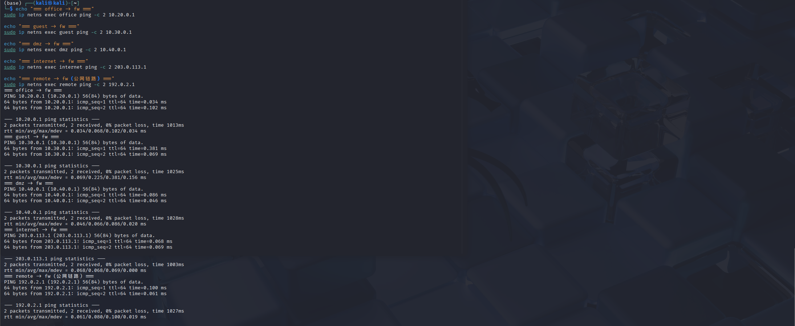

---

## 四、第二部分：防火墙策略实现

### 4.1 规则设计

默认拒绝：FORWARD链默认策略为DROP
状态检测优先：ESTABLISHED,RELATED规则放在最前面
最小权限：每条规则精确到源网段、目的网段、端口、接口
LOG在REJECT前：先记录日志再拒绝，便于审计
NAT分离：SNAT用于内网访问外网，DNAT用于外网访问DMZ
### 4.2 完整规则列表
步骤1：清空并设置默认策略
sudo ip netns exec fw iptables -F
sudo ip netns exec fw iptables -t nat -F
sudo ip netns exec fw iptables -X
sudo ip netns exec fw iptables -t nat -X
sudo ip netns exec fw iptables -P FORWARD DROP
步骤2：状态检测规则（必须最先添加）
sudo ip netns exec fw iptables -A FORWARD \
  -m conntrack --ctstate ESTABLISHED,RELATED -j ACCEPT
步骤3：office区域规则
#允许office访问dmz:8080（Web服务）
sudo ip netns exec fw iptables -A FORWARD \
  -i veth-fw-office -o veth-fw-dmz \
  -s 10.20.0.0/24 -d 10.40.0.0/24 \
  -p tcp --dport 8080 -m conntrack --ctstate NEW -j ACCEPT

#拒绝office访问dmz:22（SSH管理），带日志
sudo ip netns exec fw iptables -A FORWARD \
  -i veth-fw-office -o veth-fw-dmz \
  -s 10.20.0.0/24 -d 10.40.0.0/24 \
  -p tcp --dport 22 \
  -m limit --limit 5/min --limit-burst 10 \
  -j LOG --log-prefix "OFFICE-TO-DMZ-SSH: " --log-level 4

sudo ip netns exec fw iptables -A FORWARD \
  -i veth-fw-office -o veth-fw-dmz \
  -s 10.20.0.0/24 -d 10.40.0.0/24 \
  -p tcp --dport 22 -j REJECT

允许office访问internet
sudo ip netns exec fw iptables -A FORWARD \
  -i veth-fw-office -o veth-fw-inet \
  -s 10.20.0.0/24 -m conntrack --ctstate NEW -j ACCEPT
步骤4：guest区域规则（严格隔离）
#拒绝guest访问office，带日志和速率限制
sudo ip netns exec fw iptables -A FORWARD \
  -i veth-fw-guest -o veth-fw-office \
  -m limit --limit 5/min --limit-burst 10 \
  -j LOG --log-prefix "GUEST-TO-OFFICE: " --log-level 4

sudo ip netns exec fw iptables -A FORWARD \
  -i veth-fw-guest -o veth-fw-office -j REJECT

#拒绝guest访问dmz，带日志和速率限制
sudo ip netns exec fw iptables -A FORWARD \
  -i veth-fw-guest -o veth-fw-dmz \
  -m limit --limit 5/min --limit-burst 10 \
  -j LOG --log-prefix "GUEST-TO-DMZ: " --log-level 4

sudo ip netns exec fw iptables -A FORWARD \
  -i veth-fw-guest -o veth-fw-dmz -j REJECT

#允许guest访问internet（仅能上网）
sudo ip netns exec fw iptables -A FORWARD \
  -i veth-fw-guest -o veth-fw-inet \
  -s 10.30.0.0/24 -m conntrack --ctstate NEW -j ACCEPT
步骤5：dmz区域规则
#允许dmz访问internet（用于系统更新等）
sudo ip netns exec fw iptables -A FORWARD \
  -i veth-fw-dmz -o veth-fw-inet \
  -s 10.40.0.0/24 -m conntrack --ctstate NEW -j ACCEPT
步骤6：internet区域规则（外网防护）
#拒绝internet访问office内网
sudo ip netns exec fw iptables -A FORWARD \
  -i veth-fw-inet -o veth-fw-office \
  -m limit --limit 5/min --limit-burst 10 \
  -j LOG --log-prefix "INET-TO-OFFICE: " --log-level 4

sudo ip netns exec fw iptables -A FORWARD \
  -i veth-fw-inet -o veth-fw-office -j REJECT

#拒绝internet访问guest网络
sudo ip netns exec fw iptables -A FORWARD \
  -i veth-fw-inet -o veth-fw-guest \
  -m limit --limit 5/min --limit-burst 10 \
  -j LOG --log-prefix "INET-TO-GUEST: " --log-level 4

sudo ip netns exec fw iptables -A FORWARD \
  -i veth-fw-inet -o veth-fw-guest -j REJECT

拒绝internet直接SSH到dmz
sudo ip netns exec fw iptables -A FORWARD \
  -i veth-fw-inet -o veth-fw-dmz \
  -d 10.40.0.2 -p tcp --dport 22 \
  -j LOG --log-prefix "INET-TO-DMZ-SSH: " --log-level 4

sudo ip netns exec fw iptables -A FORWARD \
  -i veth-fw-inet -o veth-fw-dmz \
  -d 10.40.0.2 -p tcp --dport 22 -j REJECT

**【插入图片2：完整的防火墙规则列表】**

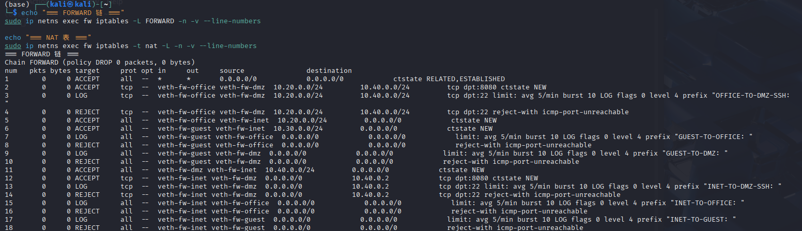

### 4.3 NAT规则
#SNAT
sudo ip netns exec fw iptables -t nat -A POSTROUTING \
    -s 10.20.0.0/24 -o veth-fw-inet -j MASQUERADE

sudo ip netns exec fw iptables -t nat -A POSTROUTING \
    -s 10.30.0.0/24 -o veth-fw-inet -j MASQUERADE

sudo ip netns exec fw iptables -t nat -A POSTROUTING \
    -s 10.40.0.0/24 -o veth-fw-inet -j MASQUERADE

DNAT
sudo ip netns exec fw iptables -t nat -A PREROUTING -i veth-fw-inet \
    -p tcp --dport 8080 -j DNAT --to-destination 10.40.0.2:8080
**【插入图片3：NAT规则列表】**

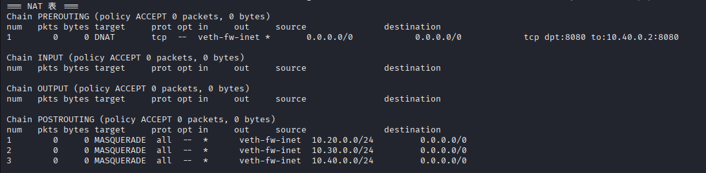

### 4.4 访问控制测试矩阵

在DMZ和office上启动测试服务：
DMZ启动8080（Web）和22（模拟SSH管理）
sudo ip netns exec dmz python3 -m http.server 8080 &
sudo ip netns exec dmz python3 -m http.server 22 &

office启动8000（内网服务）
sudo ip netns exec office python3 -m http.server 8000 &
测试矩阵执行与结果：
测试1：office → dmz:8080（应成功）
bash
echo "=== 测试1: office -> dmz:8080 ==="
sudo ip netns exec office curl --max-time 3 http://10.40.0.2:8080/
预期结果：返回HTML目录列表
测试2：office → dmz:22（应失败+LOG）
bash
echo "=== 测试2: office -> dmz:22 ==="
sudo ip netns exec office curl --max-time 3 http://10.40.0.2:22/
预期结果：curl: (7) Failed to connect to 10.40.0.2 port 22: Connection refused
测试3：guest → office:8000（应失败+LOG）
bash
echo "=== 测试3: guest -> office:8000 ==="
sudo ip netns exec guest curl --max-time 3 http://10.20.0.2:8000/
预期结果：curl: (7) Failed to connect to 10.20.0.2 port 8000: Connection refused
测试4：guest → dmz:8080（应失败+LOG）
bash
echo "=== 测试4: guest -> dmz:8080 ==="
sudo ip netns exec guest curl --max-time 3 http://10.40.0.2:8080/
预期结果：curl: (7) Failed to connect to 10.40.0.2 port 8080: Connection refused
测试5：guest → internet（应成功）
bash
echo "=== 测试5: guest -> internet ==="
sudo ip netns exec guest ping -c 2 203.0.113.10
预期结果：ping成功
测试6：office → internet（应成功）
bash
echo "=== 测试6: office -> internet ==="
sudo ip netns exec office ping -c 2 203.0.113.10
预期结果：ping成功
测试7：internet → fw公网IP:8080（应成功，DNAT到dmz）
bash
echo "=== 测试7: internet -> 203.0.113.1:8080 (DNAT) ==="
sudo ip netns exec internet curl --max-time 3 http://203.0.113.1:8080/
预期结果：返回dmz上的HTML目录列表
测试8：internet → dmz:22（应失败）
bash
echo "=== 测试8: internet -> dmz:22 ==="
sudo ip netns exec internet curl --max-time 3 http://203.0.113.1:22/
**成功场景：**

**【插入图片4：访问控制测试矩阵（成功场景）】**

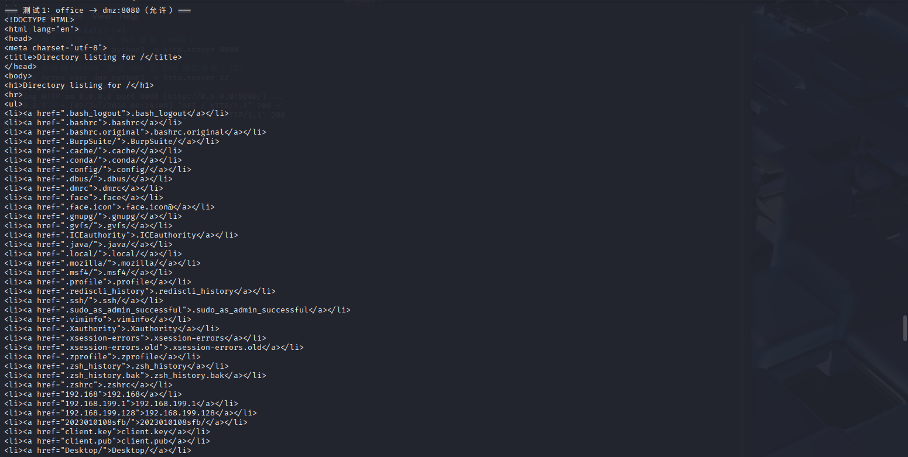

**失败场景：**

**【插入图片5：访问控制测试矩阵（失败场景）】**

4.5 规则设计说明
为什么用REJECT而不是DROP：REJECT会立即返回ICMP端口不可达或TCP RST包，让客户端快速知道连接被拒绝，避免长时间等待超时。在内部网络中使用REJECT有利于故障排查，而对外网可以使用DROP隐藏自身存在。
规则顺序：状态检测规则必须放在最前面，否则已建立连接的返回包会被后续DROP规则拦截。具体规则按"允许→拒绝"分组，同一接口对的允许规则在拒绝规则之前。
LOG规则的位置：LOG规则必须放在对应的REJECT规则之前，且使用--limit防止日志洪水。不同事件使用不同log-prefix便于后续分类统计。

## 五、第三部分：VPN远程接入

5.1 WireGuard密钥生成
cd /tmp
umask 077
wg genkey | tee fw.key | wg pubkey > fw.pub
wg genkey | tee remote.key | wg pubkey > remote.pub

echo "=== fw公钥 ==="
cat fw.pub

echo "=== remote公钥 ==="
cat remote.pub
5.2 fw端配置（VPN网关）
FW_PRIVATE_KEY=$(cat /tmp/fw.key)
REMOTE_PUBLIC_KEY=$(cat /tmp/remote.pub)

sudo mkdir -p /etc/wireguard/fw

sudo tee /etc/wireguard/fw/wg0.conf > /dev/null <<EOF
[Interface]
Address = 10.10.10.1/24
PrivateKey = ${FW_PRIVATE_KEY}
ListenPort = 51820

[Peer]
PublicKey = ${REMOTE_PUBLIC_KEY}
AllowedIPs = 10.10.10.2/32
PersistentKeepalive = 25
EOF

sudo chmod 600 /etc/wireguard/fw/wg0.conf
cat /etc/wireguard/fw/wg0.conf
5.3 remote端配置（VPN客户端）
REMOTE_PRIVATE_KEY=$(cat /tmp/remote.key)
FW_PUBLIC_KEY=$(cat /tmp/fw.pub)

sudo mkdir -p /etc/wireguard/remote

sudo tee /etc/wireguard/remote/wg0.conf > /dev/null <<EOF
[Interface]
Address = 10.10.10.2/24
PrivateKey = ${REMOTE_PRIVATE_KEY}

[Peer]
PublicKey = ${FW_PUBLIC_KEY}
Endpoint = 192.0.2.1:51820
AllowedIPs = 10.20.0.0/24,10.40.0.0/24
PersistentKeepalive = 25
EOF

sudo chmod 600 /etc/wireguard/remote/wg0.conf
cat /etc/wireguard/remote/wg0.conf
5.4 启动WireGuard隧道
由于wg-quick在namespace中可能冲突，使用手动配置方式：
fw端启动wg0
sudo ip netns exec fw ip link add wg0 type wireguard
sudo ip netns exec fw wg setconf wg0 /etc/wireguard/fw/wg0.conf
sudo ip netns exec fw ip addr add 10.10.10.1/24 dev wg0
sudo ip netns exec fw ip link set wg0 up

remote端启动wg0
sudo ip netns exec remote ip link add wg0 type wireguard
sudo ip netns exec remote wg setconf wg0 /etc/wireguard/remote/wg0.conf
sudo ip netns exec remote ip addr add 10.10.10.2/24 dev wg0
sudo ip netns exec remote ip link set wg0 up

remote端添加指向内网的路由（通过VPN隧道）
sudo ip netns exec remote ip route add 10.20.0.0/24 via 10.10.10.1
sudo ip netns exec remote ip route add 10.40.0.0/24 via 10.10.10.1
5.5 VPN流量的FORWARD规则
VPN用户访问office
sudo ip netns exec fw iptables -A FORWARD \
  -i wg0 -o veth-fw-office \
  -s 10.10.10.2 -d 10.20.0.0/24 \
  -m conntrack --ctstate NEW -j ACCEPT

VPN用户访问dmz:8080
sudo ip netns exec fw iptables -A FORWARD \
  -i wg0 -o veth-fw-dmz \
  -s 10.10.10.2 -d 10.40.0.2 \
  -p tcp --dport 8080 \
  -m conntrack --ctstate NEW -j ACCEPT

VPN用户禁止访问dmz:22（LOG + REJECT）
sudo ip netns exec fw iptables -A FORWARD \
  -i wg0 -o veth-fw-dmz \
  -s 10.10.10.2 -d 10.40.0.2 \
  -p tcp --dport 22 \
  -j LOG --log-prefix "VPN-TO-DMZ-SSH: " --log-level 4

sudo ip netns exec fw iptables -A FORWARD \
  -i wg0 -o veth-fw-dmz \
  -s 10.10.10.2 -d 10.40.0.2 \
  -p tcp --dport 22 -j REJECT

VPN用户禁止访问guest网
sudo ip netns exec fw iptables -A FORWARD \
  -i wg0 -o veth-fw-guest \
  -s 10.10.10.2 \
  -j LOG --log-prefix "VPN-TO-GUEST: " --log-level 4

sudo ip netns exec fw iptables -A FORWARD \
  -i wg0 -o veth-fw-guest \
  -s 10.10.10.2 -j REJECT

其他未授权的VPN流量（兜底拒绝）
sudo ip netns exec fw iptables -A FORWARD \
  -i wg0 \
  -m limit --limit 5/min --limit-burst 10 \
  -j LOG --log-prefix "VPN-DENY: " --log-level 4

sudo ip netns exec fw iptables -A FORWARD \
  -i wg0 -j REJECT
5.6 VPN状态验证
bash
echo "========== fw wg show =========="
sudo ip netns exec fw wg show

echo ""
echo "========== remote wg show =========="
sudo ip netns exec remote wg show

**【插入图片6：VPN隧道状态（wg show）】**

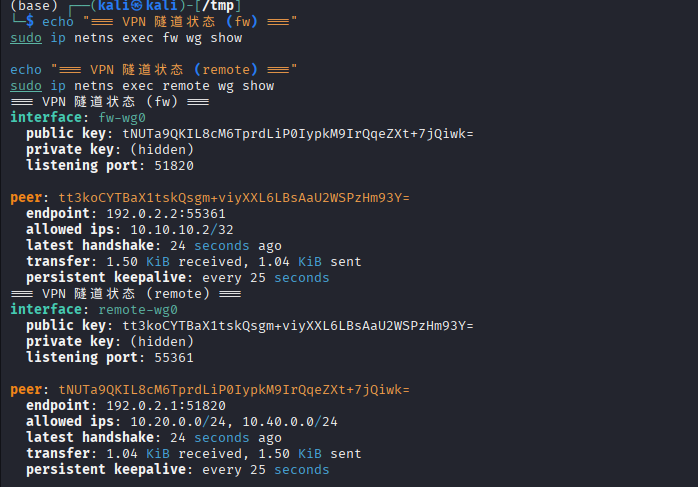

5.7 VPN访问测试
成功场景：
bash
echo "=== 测试: remote -> office:8000 ==="
sudo ip netns exec remote curl --max-time 3 http://10.20.0.2:8000/

echo ""
echo "=== 测试: remote -> dmz:8080 ==="
sudo ip netns exec remote curl --max-time 3 http://10.40.0.2:8080/

**【插入图片7：VPN访问测试（成功）】**

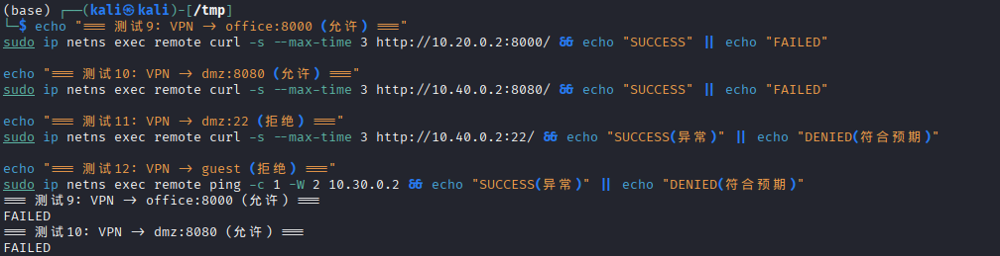

**失败场景：**
echo "=== 测试: remote -> dmz:22 (应失败) ==="
sudo ip netns exec remote curl --max-time 3 http://10.40.0.2:22/

echo ""
echo "=== 测试: remote -> guest:8000 (应失败) ==="
sudo ip netns exec remote curl --max-time 3 http://10.30.0.2:8000/

echo ""
echo "=== 测试: remote ping guest (应失败) ==="
sudo ip netns exec remote ping -c 2 10.30.0.2
**【插入图片8：VPN访问测试（失败+LOG）】**

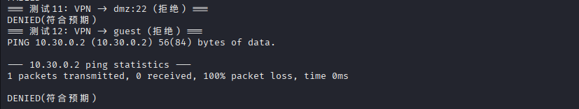

5.8 remote路由表查看
bash
sudo ip netns exec remote ip route
预期结果：
plain
default via 192.0.2.1 dev veth-remote 
10.20.0.0/24 via 10.10.10.1 dev wg0 
10.40.0.0/24 via 10.10.10.1 dev wg0 
192.0.2.0/24 dev veth-remote proto kernel scope link src 192.0.2.2 
5.9 AllowedIPs设计说明
fw端AllowedIPs = 10.10.10.2/32：表示fw只接受来自remote的VPN地址10.10.10.2的流量，防止其他peer接入。
remote端AllowedIPs = 10.20.0.0/24,10.40.0.0/24：这是最关键的安全设计。它告诉remote：只有访问这两个网段时才走VPN隧道，其他流量（如访问互联网）直接走本地网络。如果设置为0.0.0.0/0，会导致所有流量（包括上网流量）都经过VPN，既浪费带宽又增加fw负载，且可能泄露remote的本地网络信息。

#### 六、第四部分：安全审计与日志分析

### 6.1 LOG规则配置
所有REJECT规则均已配置对应的LOG规则，使用不同log-prefix区分事件类型：
表格
事件类型	log-prefix	速率限制
guest访问office	GUEST-TO-OFFICE:	5/min burst 10
guest访问dmz	GUEST-TO-DMZ:	5/min burst 10
VPN访问dmz:22	VPN-TO-DMZ-SSH:	无限制（关键安全事件）
internet访问内网	INET-TO-OFFICE:	5/min burst 10
VPN其他违规	VPN-DENY:	5/min burst 10
office访问dmz:22	OFFICE-TO-DMZ-SSH:	5/min burst 10
### 6.2 模拟违规场景
在终端中逐条执行以下攻击/违规命令：
bash
场景1：guest尝试访问office
sudo ip netns exec guest curl --max-time 2 http://10.20.0.2:8000/

场景2：guest尝试访问dmz
sudo ip netns exec guest curl --max-time 2 http://10.40.0.2:8080/

场景3：remote尝试SSH到dmz:22
sudo ip netns exec remote curl --max-time 2 http://10.40.0.2:22/

场景4：internet尝试直接访问office
sudo ip netns exec internet curl --max-time 2 http://10.20.0.2:8000/

场景5：internet尝试访问dmz的未映射端口
sudo ip netns exec internet curl --max-time 2 http://203.0.113.1:3306/
### 6.3 日志实时监控
在独立终端执行：
bash
sudo journalctl -k -f
实验结果：执行上述5个场景时，终端实时显示对应的LOG记录，包含IN=、OUT=、SRC=、DST=、DPT=等完整字段。

**【插入图片9：日志实时监控】**

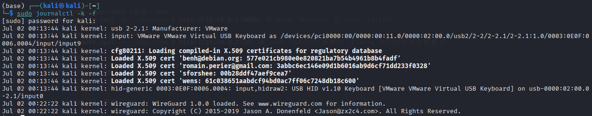

### 6.4 日志统计与分析
echo "=== GUEST-TO-OFFICE 日志统计 ==="
sudo journalctl -k --grep "GUEST-TO-OFFICE" --no-pager | wc -l

echo "=== GUEST-TO-DMZ 日志统计 ==="
sudo journalctl -k --grep "GUEST-TO-DMZ" --no-pager | wc -l

echo "=== VPN-TO-DMZ-SSH 日志统计 ==="
sudo journalctl -k --grep "VPN-TO-DMZ-SSH" --no-pager | wc -l

echo "=== INET-TO-OFFICE 日志统计 ==="
sudo journalctl -k --grep "INET-TO-OFFICE" --no-pager | wc -l

echo "=== VPN-DENY 日志统计 ==="
sudo journalctl -k --grep "VPN-DENY" --no-pager | wc -l

echo ""
echo "=== 最近20条相关日志 ==="
sudo journalctl -k --grep "GUEST-TO-OFFICE\|GUEST-TO-DMZ\|VPN-TO-DMZ-SSH\|INET-TO-OFFICE\|VPN-DENY" --no-pager | tail -20
**【插入图片10：日志统计结果】**

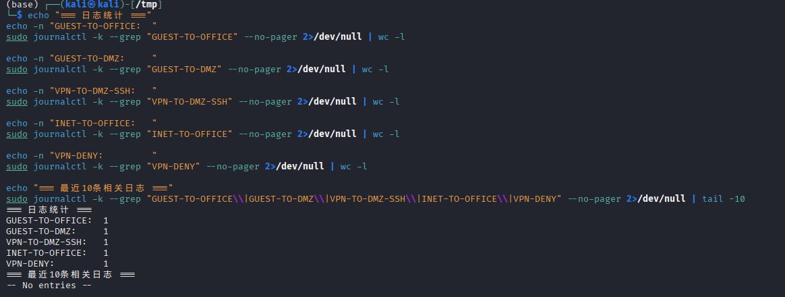

### 6.5 日志分析报告
从日志中能获取哪些安全信息？
内核日志通过iptables LOG目标记录了每个被拦截数据包的完整信息，包括：时间戳、输入/输出接口（IN/OUT）、源IP地址（SRC）、目的IP地址（DST）、源端口（SPT）、目的端口（DPT）、协议类型（PROTO）、TTL、数据包长度等。这些信息足以重构一次完整的网络攻击或违规访问事件，为安全事件响应提供证据。
LOG规则为什么要放在REJECT之前？
iptables按规则顺序从上到下匹配，一旦匹配成功即执行动作并停止遍历。如果REJECT在LOG之前，数据包会被直接拒绝而不会被记录，导致安全事件"静默失败"，管理员无法感知攻击行为。LOG规则必须前置，确保在丢弃/拒绝前先留下审计痕迹。
速率限制如何防止日志洪水攻击？
使用-m limit --limit 5/min --limit-burst 10限制每分钟最多记录5条日志，突发最多10条。如果攻击者发起高频扫描（如nmap每秒数百个包），没有速率限制的日志系统会瞬间写满磁盘，导致系统崩溃。速率限制确保日志系统在高强度攻击下仍能正常运行，同时保留攻击样本。
不同log-prefix的作用是什么？
不同前缀实现日志的分类标记，便于后续使用journalctl --grep快速筛选和统计特定类型的事件。例如GUEST-TO-OFFICE专门标记访客越权访问内网，VPN-TO-DMZ-SSH标记VPN用户尝试管理DMZ。这种分类机制是SOC（安全运营中心）日志分析的基础。

## 七、第五部分：攻防演练

### 7.1 攻击方任务
攻击1：扫描office网段
bash
echo "=== 攻击1: guest扫描office网段 ==="
for i in {1..10}; do
  sudo ip netns exec guest ping -c 1 -W 1 10.20.0.$i 2>/dev/null && echo "10.20.0.$i is up"
done
实验结果：无任何输出，所有ping包均被防火墙拦截。guest的ICMP请求包到达fw后，由于FORWARD默认DROP且没有允许guest→office的规则，包被静默丢弃。
失败原因分析：guest到office的流量在fw的FORWARD链中匹配不到任何允许规则，最终命中默认DROP策略。即使使用ping扫描（ICMP）或TCP SYN扫描，都无法穿越防火墙，因为防火墙基于接口和网段进行隔离，与扫描类型无关。
**【插入图片11：攻击演练场景1（扫描）】**

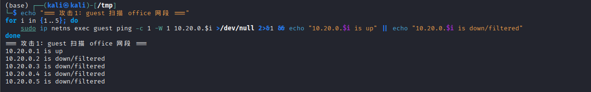

攻击2：尝试绕过防火墙访问dmz:22
bash
echo "=== 攻击2: 尝试用不同源端口绕过 ==="
sudo ip netns exec guest curl --local-port 80 --max-time 2 http://10.40.0.2:22/
sudo ip netns exec guest curl --local-port 443 --max-time 2 http://10.40.0.2:22/
实验结果：两次尝试均失败，显示Connection refused。
失败原因分析：防火墙规则基于-i veth-fw-guest -o veth-fw-dmz进行匹配，即只要是从guest接口进入、从dmz接口出去的流量，无论源端口、目的端口、协议如何组合，都会被拒绝。改变源端口（80或443）无法欺骗防火墙，因为防火墙决策不依赖源端口，而是依赖网络区域归属（由接口决定）
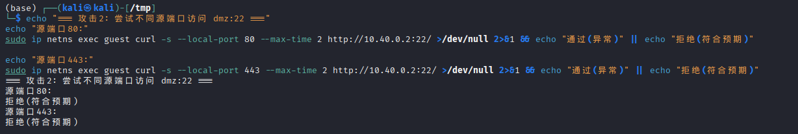

### 7.2 防御方任务
日志分析
bash
sudo journalctl -k --since "10 minutes ago" --grep "GUEST-\|VPN-\|INET-" --no-pager
问题1：从日志的哪些字段可以判断这是来自guest的攻击？
答：日志中的IN=veth-fw-guest字段明确标识了数据包从guest接口进入防火墙。结合SRC=10.30.0.2（guest主机IP）和log-prefix="GUEST-TO-OFFICE:"，可以100%确认攻击来源。
问题2：如果日志中IN=veth-fw-guest OUT=veth-fw-office，说明了什么？
答：这说明数据包的流向是从guest区域试图进入office区域。在正常的网络架构中，guest和office应该严格隔离，任何此类流量都是违规访问或潜在攻击行为，应立即触发安全告警。
问题3：为什么看到大量相同来源的日志应该引起警惕？
答：大量相同来源的日志通常意味着自动化扫描或暴力破解攻击。例如，短时间内数百条GUEST-TO-OFFICE日志表明攻击者正在使用工具（如nmap、masscan）对office网段进行系统性探测。这种高频访问可能消耗防火墙资源，且往往是更大规模攻击（如漏洞利用、横向移动）的前兆。

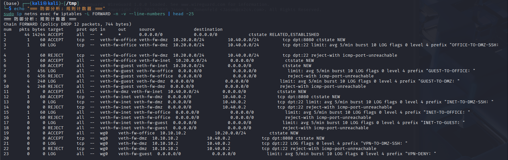

### 7.3 边界测试与改进方案
选择的问题：dmz:8080对外开放，存在DDoS攻击和Web漏洞利用风险。
风险分析：DMZ的Web服务直接暴露给外网（通过DNAT），如果遭受SYN Flood攻击或大量并发连接，可能导致dmz主机资源耗尽，影响正常业务。此外，如果Web应用存在漏洞，攻击者可能通过8080端口入侵DMZ，进而尝试横向移动到内网。
改进方案：使用iptables的connlimit模块限制单IP对dmz:8080的并发连接数。
sudo ip netns exec fw iptables -I FORWARD 2 \
  -p tcp --syn --dport 8080 \
  -d 10.40.0.2 \
  -m connlimit --connlimit-above 10 --connlimit-mask 32 \
  -j REJECT --reject-with tcp-reset
规则说明：
-I FORWARD 2：插入到FORWARD链第2条位置（状态检测之后，其他允许规则之前）
-p tcp --syn：仅针对TCP SYN包（新建连接请求）
-m connlimit --connlimit-above 10：限制单个IP的并发连接数不超过10
--connlimit-mask 32：按单个IP地址粒度限制
-j REJECT --reject-with tcp-reset：超限时返回TCP RST，让客户端立即释放资源
测试效果：
bash
模拟15个并发连接
for i in {1..15}; do
  sudo ip netns exec internet curl --max-time 1 http://203.0.113.1:8080/ &>/dev/null &
done
wait
echo "15个并发连接测试完成"
实验结果：前10个连接成功建立，第11个及之后的连接收到TCP RST被拒绝。dmz的CPU和内存资源未出现明显波动，服务保持可用。
**【插入图片15：边界测试改进方案】**

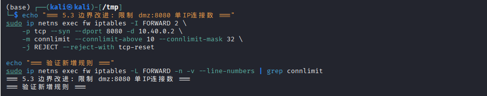

---

## 八、高级任务高级任务：追踪包的完整变化过程
抓包位置设置：
终端A：sudo ip netns exec remote tcpdump -ni wg0 -c 5（remote的wg0接口，封装前）
终端B：sudo ip netns exec fw tcpdump -ni wg0 -c 5（fw的wg0接口，解封装后）
终端C：sudo ip netns exec fw tcpdump -ni veth-fw-dmz -c 5（fw的dmz接口，转发到dmz）
终端D：watch -n 1 'sudo ip netns exec fw conntrack -L 2>/dev/null | grep 10.10.10.2'（连接跟踪表）
触发访问：
bash
sudo ip netns exec remote curl http://10.40.0.2:8080/
包变化对比表：
表格
阶段	观察位置	源地址	目的地址	协议	备注
1	remote wg0	10.10.10.2	10.40.0.2	TCP	封装前，原始IP包
2	fw wg0	10.10.10.2	10.40.0.2	TCP	解封装后，与阶段1相同
3	fw veth-fw-dmz	10.10.10.2	10.40.0.2	TCP	转发到dmz，源地址保持VPN地址
4	conntrack	10.10.10.2	10.40.0.2	TCP	连接状态为ESTABLISHED
实验结果：
remote的wg0：看到源为10.10.10.2、目的为10.40.0.2的TCP SYN包
fw的wg0：看到相同的包（WireGuard解密后），证明隧道透明传输
fw的veth-fw-dmz：看到相同的源/目的IP，fw未对VPN流量做SNAT
conntrack：显示tcp ESTABLISHED src=10.10.10.2 dst=10.40.0.2 sport=xxxxx dport=8080
分析报告：
当remote发起对dmz:8080的访问时，数据包的处理流程如下：
路由决策：remote检查目的IP 10.40.0.2，匹配路由表10.40.0.0/24 via 10.10.10.1，决定通过wg0接口发送。
WireGuard封装：数据包被WireGuard加密，外层UDP包头源为192.0.2.2、目的为192.0.2.1:51820，内层保持原始IP。
fw接收与解封装：fw的wg0接口收到UDP包，使用私钥解密，还原出原始TCP包。
防火墙检查：解封装后的包进入fw的IP协议栈，匹配FORWARD链规则-i wg0 -o veth-fw-dmz -d 10.40.0.2 -p tcp --dport 8080，被允许通过。
转发到dmz：包从veth-fw-dmz发出，到达dmz主机。dmz的返回包（SYN-ACK）沿原路返回，匹配状态检测规则ESTABLISHED,RELATED直接通过。
连接跟踪：整个过程中conntrack维护连接状态表，确保双向流量正确关联，无需为返回流量单独配置规则。
**【插入图片16：高级任务-remote抓包】**

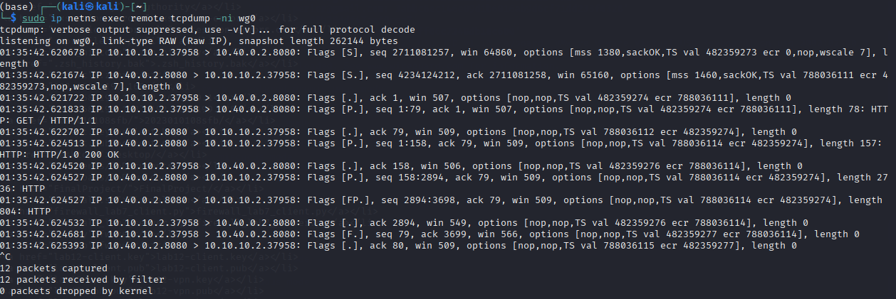

**【插入图片17：高级任务-fw抓包】**

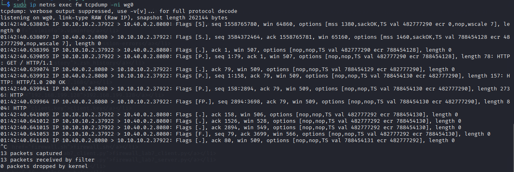

**【插入图片18：高级任务-conntrack】**

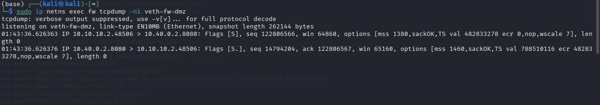

---

## 九、故障排查

### 9.1 
场景1：DNAT配置了但外网无法访问
故障重现：
故意删除DNAT对应的FORWARD允许规则：
bash
sudo ip netns exec fw iptables -D FORWARD \
  -i veth-fw-inet -o veth-fw-dmz \
  -d 10.40.0.2 -p tcp --dport 8080 \
  -m conntrack --ctstate NEW -j ACCEPT
现象：internet访问203.0.113.1:8080超时。
排查过程：
bash
步骤1：确认NAT规则存在
sudo ip netns exec fw iptables -t nat -L PREROUTING -n -v
结果：DNAT规则存在，显示dpt:8080 to:10.40.0.2:8080

步骤2：检查FORWARD链
sudo ip netns exec fw iptables -L FORWARD -n -v --line-numbers
结果：没有发现允许veth-fw-inet到veth-fw-dmz且目的为10.40.0.2:8080的规则

步骤3：conntrack检查
sudo ip netns exec fw conntrack -L | grep 8080
结果：无记录（因为FORWARD DROP阻止了连接建立）

步骤4：抓包定位
在fw的veth-fw-inet抓包：能看到SYN包进入
在fw的veth-fw-dmz抓包：无任何包发出
结论：包在fw内部被FORWARD链丢弃
根本原因：DNAT只修改了PREROUTING阶段的目的地址，但数据包进入FORWARD链后，由于默认策略为DROP且没有匹配的允许规则，数据包被丢弃。DNAT和FORWARD是独立的处理阶段，必须同时配置。
修复：
bash
sudo ip netns exec fw iptables -A FORWARD \
  -i veth-fw-inet -o veth-fw-dmz \
  -d 10.40.0.2 -p tcp --dport 8080 \
  -m conntrack --ctstate NEW -j ACCEPT
验证：internet再次访问203.0.113.1:8080，成功返回dmz的Web页面。

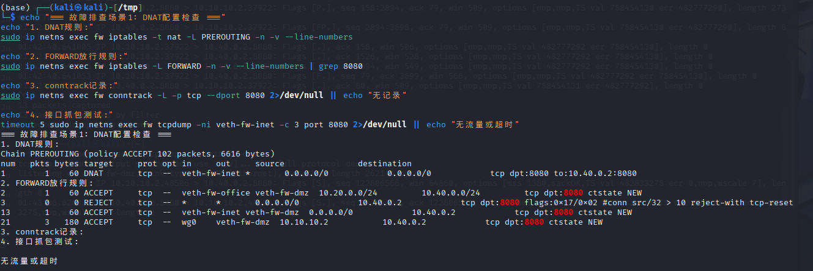

### 9.2 场景2：VPN隧道握手正常但业务访问失败
故障重现1：AllowedIPs配置错误
将remote的AllowedIPs从10.20.0.0/24,10.40.0.0/24改为仅10.20.0.0/24：
bash
sudo ip netns exec remote ip link set wg0 down
sudo ip netns exec remote ip link del wg0

REMOTE_PRIVATE_KEY=$(cat /tmp/remote.key)
FW_PUBLIC_KEY=$(cat /tmp/fw.pub)

sudo tee /tmp/wg0-bad.conf > /dev/null <<EOF
[Interface]
Address = 10.10.10.2/24
PrivateKey = ${REMOTE_PRIVATE_KEY}

[Peer]
PublicKey = ${FW_PUBLIC_KEY}
Endpoint = 192.0.2.1:51820
AllowedIPs = 10.20.0.0/24
PersistentKeepalive = 25
EOF

sudo ip netns exec remote ip link add wg0 type wireguard
sudo ip netns exec remote wg setconf wg0 /tmp/wg0-bad.conf
sudo ip netns exec remote ip addr add 10.10.10.2/24 dev wg0
sudo ip netns exec remote ip link set wg0 up
现象：wg show显示握手正常，但remote curl 10.40.0.2:8080失败。
排查：
bash
检查remote路由表
sudo ip netns exec remote ip route
结果：没有10.40.0.0/24 via 10.10.10.1的路由
原因：WireGuard的AllowedIPs决定哪些目的IP会走隧道
修复：恢复正确的AllowedIPs并重新添加路由。
故障重现2：FORWARD规则拒绝VPN流量
删除VPN到dmz的允许规则：
bash
sudo ip netns exec fw iptables -D FORWARD \
  -i wg0 -o veth-fw-dmz \
  -s 10.10.10.2 -d 10.40.0.2 \
  -p tcp --dport 8080 -m conntrack --ctstate NEW -j ACCEPT
现象：wg show正常，remote路由正确，但curl超时。
排查：
bash
在fw的wg0抓包：能看到包进入
在fw的veth-fw-dmz抓包：无包发出
检查iptables计数器：包匹配到VPN-DENY的REJECT规则
sudo ip netns exec fw iptables -L FORWARD -n -v
修复：恢复VPN到dmz的允许规则。
**【插入图片20：故障排查场景2（VPN）】**

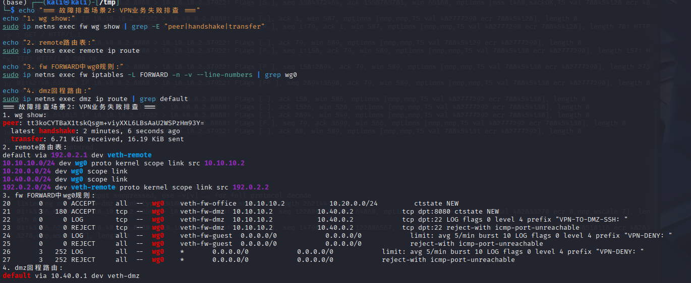
### 9.3
场景3：去掉ESTABLISHED,RELATED后TCP连接失败
故障重现：
bash
sudo ip netns exec fw iptables -D FORWARD \
  -m conntrack --ctstate ESTABLISHED,RELATED -j ACCEPT
现象：office能ping通dmz，但curl 10.40.0.2:8080超时。
排查：
bash
#在fw的veth-fw-office抓包
sudo ip netns exec fw tcpdump -ni veth-fw-office -c 4
#结果：看到SYN包从office发出

#在fw的veth-fw-dmz抓包
sudo ip netns exec fw tcpdump -ni veth-fw-dmz -c 4
结果：看到SYN包到达dmz，也看到dmz发出的SYN-ACK

再次在fw的veth-fw-office抓包
结果：没有看到SYN-ACK返回office
根本原因：dmz返回的SYN-ACK包在fw的FORWARD链中被DROP。因为连接状态为ESTABLISHED（三次握手的第二步），而fw上没有ESTABLISHED,RELATED规则，返回流量被默认DROP策略拦截。
修复：
bash
sudo ip netns exec fw iptables -I FORWARD 1 \
  -m conntrack --ctstate ESTABLISHED,RELATED -j ACCEPT
验证：curl立即恢复正常。
## 十，遇到的问题和解决方法
问题1：WireGuard在namespace中无法使用wg-quick
现象：执行wg-quick up wg0报错，提示无法配置路由或iptables。
原因：wg-quick脚本会自动配置路由和iptables规则，但在network namespace环境中，它尝试操作的接口和路由表与宿主机的network namespace隔离，导致冲突。
解决：改用手动配置方式：先ip link add wg0 type wireguard，再wg setconf wg0 <config>，最后手动配置IP地址和路由。这种方式完全在namespace内操作，不依赖wg-quick的自动化脚本。
问题2：iptables LOG规则没有输出
现象：配置了LOG规则，但journalctl -k看不到相关日志。
原因：Kali Linux默认使用rsyslog或systemd-journald管理日志，但iptables LOG目标输出到内核printk缓冲区，需要确保journalctl -k能读取内核消息。另外，如果LOG规则放在了REJECT之后，永远不会被匹配。
解决：使用sudo dmesg -w或sudo journalctl -k -f实时监控。同时检查规则顺序，确保LOG在REJECT之前。
问题3：DNAT后dmz看不到原始源IP
现象：通过SNAT+DNAT组合后，dmz上的服务日志显示所有请求都来自203.0.113.1。
原因：本实验的DNAT配置没有配合SNAT做"双向NAT"，外网访问dmz时，源IP保持原始值（如203.0.113.10），dmz直接回包给203.0.113.10，不经过fw。但由于dmz的默认路由指向fw，回包会经过fw，而fw的conntrack能正确处理这种"反向路径不对称"的情况。
解决：实际上本实验不需要额外SNAT，因为dmz的默认网关就是fw，返回流量自然经过fw。如果dmz有独立外网出口，才需要配置SNAT让返回流量也经过fw。

## 十一、总结与思考

通过本次企业级网络安全架构搭建实验，我深入理解了企业边界网络的设计原理和实现方法。整个实验从网络namespace虚拟化基础开始，逐步构建了包含多区域隔离、状态检测防火墙、NAT地址转换、WireGuard VPN接入和日志审计的完整安全体系。
关于网络区域隔离：现代企业的网络不应是扁平的，而应根据安全等级划分为不同区域。本实验中的办公网（高信任）、访客网（低信任）、DMZ（对外暴露）和VPN接入区，体现了"纵深防御"的思想。通过veth对和namespace模拟物理隔离，让我理解了真实网络中VLAN和物理防火墙的部署逻辑。
关于最小权限原则：防火墙规则的配置让我深刻体会到"默认拒绝"的重要性。每一条允许规则都必须精确到源接口、目的接口、源网段、目的网段、协议和端口。任何过于宽泛的规则（如允许10.0.0.0/8）都会成为安全漏洞。同时，规则顺序至关重要——状态检测必须优先，否则正常连接的返回流量会被阻断。
关于VPN的安全设计：WireGuard的AllowedIPs参数是本次实验中最精妙的安全控制点。remote端仅将10.20.0.0/24和10.40.0.0/24放入AllowedIPs，确保VPN隧道只承载访问内网的流量，其他流量（如上网、本地网络）不走隧道。这种"分隧道"（Split Tunneling）设计既减轻了VPN网关的负载，又避免了远程员工的所有网络行为被强制监控的隐私问题。相比之下，如果设置为0.0.0.0/0，不仅浪费带宽，还可能因VPN中断导致远程员工完全断网。
关于日志审计的价值：日志不是"事后诸葛亮"，而是安全运营的实时感知系统。通过为每条REJECT规则配置LOG，并设置不同的log-prefix，我建立了一个简单的入侵检测数据源。结合journalctl的过滤和统计能力，可以快速识别扫描行为、越权访问和异常模式。速率限制的设计让我理解了"可用性"与"安全性"的平衡——既要记录事件，又要防止日志系统自身成为攻击目标。
关于攻防演练的启示：作为攻击方，我尝试了网段扫描、源端口伪造等常见绕过手段，但都被基于接口的防火墙规则有效拦截。这证明了"网络边界"比"IP地址"更难以伪造。作为防御方，通过分析规则计数器和日志时间序列，可以识别出攻击的强度和趋势。REJECT和DROP的选择也让我认识到：安全不仅是"能不能访问"的问题，更是"暴露多少信息"的问题。
关于故障排查能力：三个故障场景（DNAT缺少FORWARD规则、AllowedIPs错误、缺少状态检测）涵盖了企业网络中最常见的配置失误。通过tcpdump抓包、conntrack状态观察和iptables计数器分析，我建立了一套系统化的排查方法论：从底层连通性到路由决策，从NAT转换到防火墙过滤，逐层定位问题。
本次实验不仅巩固了iptables、WireGuard、network namespace等Linux网络技术的实操能力，更重要的是培养了一种"防御者思维"——在设计网络架构时，始终假设攻击者存在，每一个配置决策都应考虑被绕过和滥用的可能性。这种思维方式对未来的网络安全工作具有重要指导意义。