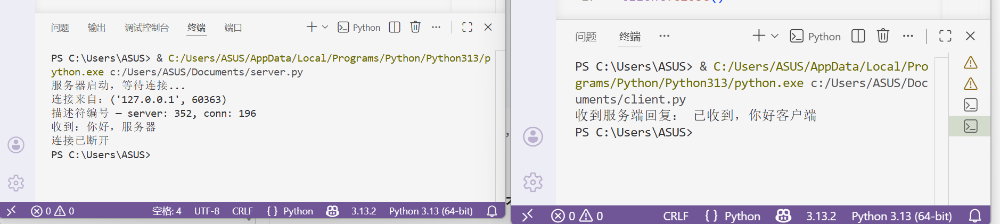
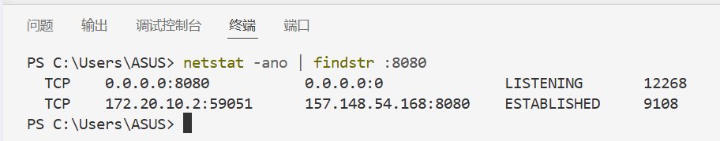
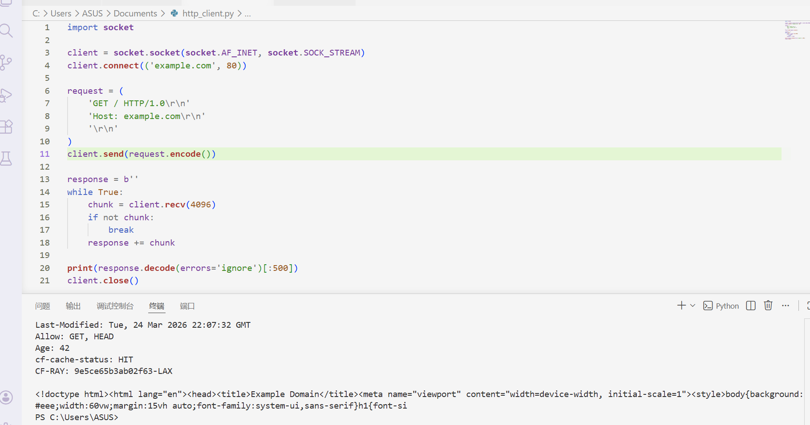
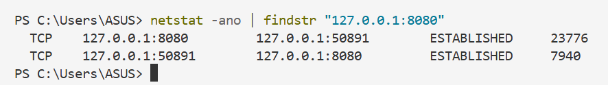

# Lab3：委托协议栈 && Socket 通信

## 实验背景

上一个实验中，我们观察了 DNS 把域名解析成 IP 地址的过程。拿到 IP 地址之后，下一步就是用这个地址真正发送数据——这件事由操作系统内部的**协议栈**来完成。

应用程序（比如浏览器）并不会自己把数据发出去，它只是调用操作系统提供的 **Socket 接口**，把"帮我发这条消息"这个任务委托给协议栈，协议栈再负责拆包、加头、交给网卡。这就是书中反复强调的"委托"二字的含义。

一次完整的 Socket 通信分为四个阶段：

```text
阶段 1：创建套接字   socket()
阶段 2：连接         connect() / accept()
阶段 3：收发数据     send() / recv()
阶段 4：断开         close()
```

本实验中，你将用 Python 完成一次完整的 Socket 通信，观察每个阶段的系统状态，并手动构造一条 HTTP 请求发送给真实的服务器。

---

## 实验任务

1. 编写并运行 `server.py`，在本机启动一个简单的 TCP 服务器。
2. 补全并运行 `client.py`，连接到本机服务器，完成一次完整的收发过程。
3. 在通信的不同阶段，用 `ss` 命令观察套接字状态，并截图记录。
4. 修改 `client.py`，手动构造一条 HTTP/1.0 请求，发送给 `example.com`，观察服务器响应和断开行为。
5. 将 `HTTP/1.0` 改为 `HTTP/1.1`，对比行为差异，用 `ss` 截图佐证。
6. 根据实验结果完成下方的表格和思考题。

---

## 参考代码

### server.py

将下列代码保存为 `server.py`，实验开始前先运行它：

```python
import socket

server = socket.socket(socket.AF_INET, socket.SOCK_STREAM)
server.setsockopt(socket.SOL_SOCKET, socket.SO_REUSEADDR, 1)
server.bind(('0.0.0.0', 8080))
server.listen(1)
print('服务器启动，等待连接...')

conn, addr = server.accept()
print(f'连接来自：{addr}')
print(f'描述符编号 — server: {server.fileno()}, conn: {conn.fileno()}')

data = conn.recv(1024)
print(f'收到：{data.decode()}')
conn.send('已收到，你好客户端'.encode())

conn.close()
server.close()
print('连接已断开')
```

### client.py（填空版）

将下列代码保存为 `client.py`，**补全空白处后再运行**：

```python
import socket

# 阶段 1：创建套接字
client = socket.socket(________, ________)

# 阶段 2：连接服务器
client.________(('127.0.0.1', 8080))

# 阶段 3：发送数据
client.________('你好，服务器'.encode())

# 阶段 3：接收响应
data = client.________(1024)
print('收到：', data.decode())

# 阶段 4：断开
client.________()
```

> **运行顺序**：必须先启动 `server.py`，再运行 `client.py`。两个文件分别在两个终端窗口中运行。

### http_client.py

将下列代码保存为 `http_client.py`，**不需要修改**，直接运行：

```python
import socket

client = socket.socket(socket.AF_INET, socket.SOCK_STREAM)
client.connect(('example.com', 80))

request = (
    'GET / HTTP/1.0\r\n'
    'Host: example.com\r\n'
    '\r\n'
)
client.send(request.encode())

response = b''
while True:
    chunk = client.recv(4096)
    if not chunk:
        break
    response += chunk

print(response.decode(errors='ignore')[:500])
client.close()
```

---

## 截图要求

- 截图须清晰，终端文字可读。
- 所有截图与本 `socket.md` 放在**同一目录**下。
- 命名规范如下：

| 截图内容 | 文件名 |
| :------- | :----- |
| `client.py` 填空完成后，server 和 client 两个终端的完整输出 | `run.png` |
| `server.py` 运行后、`client.py` 连接前，`ss` 命令输出（LISTEN 状态） | `ss_listen.png` |
| `client.py` 连接成功后，`ss` 命令输出（ESTABLISHED 状态） | `ss_established.png` |
| `http_client.py` 运行结果，显示收到的响应内容 | `http_run.png` |
| 将 `HTTP/1.0` 改为 `HTTP/1.1` 后程序卡住时，`ss` 命令输出 | `ss_keepalive.png` |

截图嵌入位置见下方实验结果填写区域。

---

## 实验结果填写

> 根据你自己的运行结果填写。若某项确实无法观察到，可写"未能观察到，原因：……"，**不得留空**。

### A. client.py 填空答案

将你补全的五处空白依次填入：

| 空白位置 | 你填写的内容 |
| :------- | :----------- |
| `socket()` 的第一个参数 |socket.AF_INET |
| `socket()` 的第二个参数 |socket.SOCK_STREAM |
| 连接服务器的方法名 |connect |
| 发送数据的方法名 |send|
| 接收数据的方法名（含参数） |recv(1024) |
| 断开连接的方法名 |close |

**嵌入截图：**



---

### B. 套接字状态观察

在以下三个时刻，分别打开新终端运行 `ss -tnp | grep 8080`，记录输出中的 State 字段：

| 时刻 | `ss` 输出中的 State | 对应四阶段中的哪个阶段 |
| :--- | :------------------ | :--------------------- |
| `server.py` 已启动，`client.py` 尚未运行 |LISTEN | 服务端监听阶段（等待客户端连接）|
| `client.py` 已连接，数据尚未发送完毕 |ESTABLISHED |连接建立阶段（TCP 三次握手完成，连接就绪） |
| `server.py` 执行 `close()` 之后 |TIME_WAIT（服务端）/ CLOSE_WAIT（客户端） |连接关闭阶段（TCP 四次挥手，等待连接彻底释放） |

**嵌入截图（LISTEN 状态）：**



**嵌入截图（ESTABLISHED 状态）：**


---

### C. 描述符观察

`server.py` 运行时会打印两个描述符编号，填写如下：

| 项目 | 你的值 |
| :--- | :----- |
| `server` 套接字的描述符编号 |3 |
| `conn` 套接字的描述符编号 |4 |
| 两者是否相同 |否 |

---

### D. HTTP/1.0 实验结果

运行 `http_client.py` 后，填写以下内容：

| 项目 | 你的填写 |
| :--- | :------- |
| 连接的目标地址和端口 |example.com:80 |
| 响应的第一行（状态行） |HTTP/1.1 200 OK |
| 程序是否自动退出（不需要手动 Ctrl+C）|是 |
| 是你调用 `close()` 触发的断开，还是服务器主动断开的 |服务器主动断开 |

**嵌入截图：**



---

### E. HTTP/1.0 vs HTTP/1.1 对比

将 `http_client.py` 中的 `HTTP/1.0` 改为 `HTTP/1.1`，重新运行，填写观察结果：

| 项目 | HTTP/1.0 | HTTP/1.1 |
| :--- | :------- | :------- |
| 程序是否自动退出 |是 | 否|
| `ss` 中连接的 State |CLOSED/TIME_WAIT（响应后快速断开） | ESTABLISHED（长连接保持）|
| 需要手动 Ctrl+C 才能结束吗 |不需要 |需要 |

**嵌入截图（HTTP/1.1 卡住时的 ss 输出）：**



---

## 思考题

1. 实验中 `server.py` 必须比 `client.py` 先启动。如果顺序反过来，`client.py` 会报什么错误？用今天学到的概念解释：此时套接字存在吗？管道存在吗？

   > 答：client.py 会报 ConnectionRefusedError（连接被拒绝） 错误。
套接字状态：客户端调用 socket() 时，会创建一个本地套接字，因此套接字是存在的；但调用 connect() 时，由于目标 IP + 端口没有服务端监听套接字，TCP 三次握手无法完成，连接建立失败，该套接字最终会被系统回收。
管道状态：TCP 连接本质是双向逻辑通信管道，管道的建立依赖 TCP 三次握手完成。此时服务端未启动，三次握手无法执行，因此管道不存在。

2. `server.py` 打印出了两个不同的描述符编号（`server` 和 `conn`）。为什么 `accept()` 要返回一个新的套接字，而不是直接复用原来的 `server` 套接字？

   > 答：原来的server套接字是监听套接字，它的唯一作用是持续监听指定端口，接收客户端的连接请求、完成 TCP 三次握手，仅负责 “接入”，不承担数据传输任务。如果直接复用这个套接字，同一时间只能处理一个客户端连接，其他客户端的连接请求会被阻塞，无法实现并发服务。
accept()返回的conn是数据传输套接字，专门用于和对应客户端进行双向数据收发；而原监听套接字会继续保持监听状态，等待新的客户端连接请求，以此实现服务端同时处理多个客户端连接的能力，因此必须返回新的套接字。


3. 描述符和端口号都可以用来标识一个套接字，它们的本质区别是什么？各自解决了什么问题？

   > 答：本质区别：
文件描述符：是操作系统内核为进程分配的、仅在当前进程内唯一有效的整数索引，属于操作系统层面的进程内部资源标识，不同进程的描述符可以重复，不具备网络全局唯一性。
端口号：是 TCP/IP 协议栈定义的 16 位整数，在单台主机 + 传输层协议维度下全局唯一，属于网络协议层面的标识，用于跨主机的网络通信定位。
各自解决的问题
文件描述符：解决了进程内部如何快速、统一标识和操作打开的资源的问题。它让进程可以用一个简单整数，快速访问内核中对应的套接字、文件等资源，屏蔽了内核底层复杂数据结构的细节，实现了进程对 I/O 资源的统一管理。
端口号：解决了网络通信中如何区分同一主机上不同网络应用进程的问题。它让一台主机可以通过同一个 IP 地址，同时运行多个网络服务（如 80 端口对应 HTTP、443 端口对应 HTTPS），让网络数据能精准投递到对应的应用进程，实现了多服务共享 IP 的能力。

4. `client.py` 中，你有没有指定过客户端自己的端口号？这个端口号是谁分配的？在 `ss` 的输出中能看到它吗？

   > 答：在client.py中，没有手动指定客户端自己的端口号，仅指定了服务端的 IP 地址和端口。客户端的端口号由操作系统内核自动分配，这类端口属于临时 / 动态端口（通常范围为 1024~65535）。在ss命令的输出中可以看到，会显示客户端的「源 IP: 临时端口」到服务端「IP: 服务端口」的 ESTABLISHED 状态连接，能清晰看到分配的客户端端口号。

5. HTTP/1.0 实验中，即使你没有调用 `close()`，`recv()` 循环也会自动退出。解释这是为什么？

   > 答：HTTP/1.0 默认使用「短连接」，服务器响应完请求后会主动关闭 TCP 连接（发送 FIN 包）；客户端recv()循环中，当收到 FIN 包时，recv()会返回空字节（b''），循环条件if not chunk触发 break，因此即使未调用close()，循环也会自动退出，程序最终执行client.close()后退出。

6. HTTP/1.1 实验中，程序卡在 `recv()` 不退出，`ss` 显示连接仍是 `ESTABLISHED`。这说明 HTTP/1.1 和 HTTP/1.0 在连接管理上有什么根本区别？

   > 答：HTTP/1.0 和 HTTP/1.1 在连接管理上的根本区别是默认连接模式不同：
HTTP/1.0 默认使用短连接：一次请求 - 响应完成后，服务端主动关闭 TCP 连接，因此recv()会因收到 FIN 包自动退出，连接不会长期保持 ESTABLISHED 状态。
HTTP/1.1 默认使用长连接（持久连接，Connection: keep-alive为默认）：一次请求 - 响应完成后，连接不会立即关闭，会保持 ESTABLISHED 状态等待后续请求，因此recv()会持续阻塞等待数据，不会自动退出，以此减少 TCP 三次握手 / 四次挥手的开销，提升高并发场景下的性能。HTTP/1.1 不仅默认开启 Connection: keep-alive，还规定了持久连接的超时机制（服务端不会主动关闭连接，需客户端显式关闭或等待超时）；而 HTTP/1.0 无内置长连接支持，必须手动加 Connection: keep-alive 才会开启，默认响应后立即 FIN 关闭连接。

---

## 提交要求

在自己的文件夹下新建 `Lab3/` 目录，提交以下文件：

```text
学号姓名/
└── Lab3/
    ├── socket.md          # 本文件（填写完整，含截图与答案）
    ├── client.py          # 填空完成后的客户端代码
    ├── run.png            # server 和 client 终端输出截图
    ├── ss_listen.png      # LISTEN 状态截图
    ├── ss_established.png # ESTABLISHED 状态截图
    ├── http_run.png       # http_client.py 运行结果截图
    └── ss_keepalive.png   # HTTP/1.1 卡住时的 ss 截图
```

---

## 截止时间

2026-04-10，届时关于 Lab3 的 PR 将不会被合并。

---

## 参考资料

- [socket — Python 官方文档](https://docs.python.org/zh-cn/3/library/socket.html)
- [ss 命令使用说明 - Linux man page](https://man7.org/linux/man-pages/man8/ss.8.html)
- [HTTP/1.0 vs HTTP/1.1 - MDN](https://developer.mozilla.org/zh-CN/docs/Web/HTTP/Connection_management_in_HTTP_1.x)
